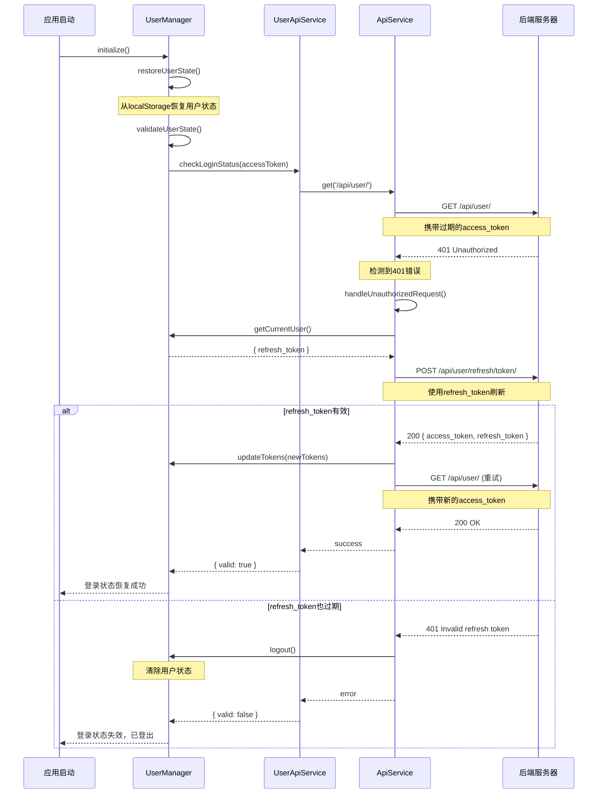
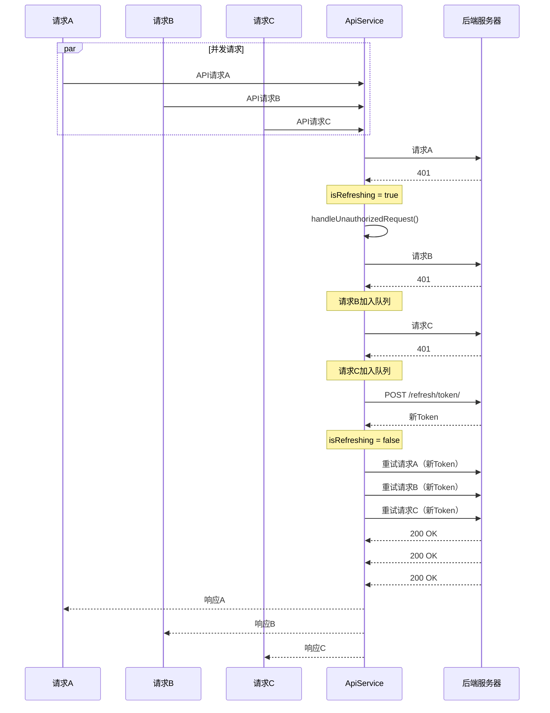

# Token管理重构 - 集中式Token刷新机制

## 问题背景

重启应用后，出现以下问题：
1. 多个401错误同时出现
2. Token刷新逻辑分散在多个类中
3. 重复的Token刷新请求
4. Token刷新失败后没有正确执行logout

错误日志示例：
```
API响应: 401 http://localhost:5173/api/user/
UserApiService.js:220 检查登录状态失败: Error: Authentication credentials were not provided
```

## 根本原因

**Token管理分散导致的混乱**：

1. **UserApiService**：有自己的`refreshToken()`方法和`_performTokenRefresh()`
2. **UserManager**：在`validateUserState()`中也有Token刷新逻辑
3. **应用启动时**：多个组件同时发起API请求，都遇到401错误，触发多次Token刷新

这种分散的设计导致：
- 难以追踪Token刷新的状态
- 并发请求可能触发多次刷新
- 错误处理不一致

## 解决方案：集中式Token管理

### 核心理念

**"Token的获取、刷新、监听应该在一个地方统一管理"**

将所有Token管理集中到 **ApiService基类**，其他服务类只负责业务逻辑。

### 架构设计

```
┌─────────────────────────────────────────────────────────┐
│                      UserManager                        │
│                   (用户状态管理)                          │
│  - currentUser                                          │
│  - isAuthenticated                                      │
│  - login() / logout()                                   │
└──────────────────────┬──────────────────────────────────┘
                       │
                       │ 注入依赖
                       ▼
┌─────────────────────────────────────────────────────────┐
│                      ApiService                         │
│              (集中式Token管理 & 401拦截)                  │
│  - userManager: UserManager引用                         │
│  - isRefreshing: boolean                                │
│  - pendingRequests: Array                               │
│  - handleUnauthorizedRequest()                          │
└──────────────────────┬──────────────────────────────────┘
                       │
                       │ 继承
            ┌──────────┴──────────┐
            ▼                     ▼
┌─────────────────┐    ┌─────────────────┐
│ UserApiService  │    │ AgentApiService │
│  (用户API)      │    │  (智能体API)     │
│  - login()      │    │  - getAgents()  │
│  - getUser()    │    │  - chat()       │
└─────────────────┘    └─────────────────┘
```

### 核心实现

#### 1. ApiService - 集中式401处理 ([ApiService.js:206-321](../../src/services/api/ApiService.js#L206-L321))

```javascript
export class ApiService {
  constructor(options = {}) {
    // Token刷新相关
    this.isRefreshing = false;
    this.refreshPromise = null;
    this.pendingRequests = [];

    // UserManager引用（由外部注入）
    this.userManager = options.userManager || null;
  }

  async sendRequest(config) {
    const response = await fetch(url, fetchOptions);

    // 🔥 集中处理401错误
    if (response.status === 401 &&
        !url.includes('/user/refresh/token/') &&
        !url.includes('/user/login/')) {
      console.warn('⚠️ [ApiService] 检测到401错误，准备刷新Token');
      return await this.handleUnauthorizedRequest(config);
    }

    return response;
  }

  async handleUnauthorizedRequest(originalConfig) {
    // 如果没有UserManager，抛出错误
    if (!this.userManager) {
      throw new Error('Authentication credentials were not provided');
    }

    // 🔥 如果正在刷新，将请求加入队列
    if (this.isRefreshing) {
      console.log('🔄 [ApiService] Token正在刷新中，请求加入队列');
      return new Promise((resolve, reject) => {
        this.pendingRequests.push({ resolve, reject, config: originalConfig });
      });
    }

    // 🔥 开始刷新Token
    this.isRefreshing = true;
    console.log('🔄 [ApiService] 开始刷新Token...');

    try {
      const currentUser = this.userManager.getCurrentUser();

      if (!currentUser || !currentUser.refresh_token) {
        throw new Error('No refresh token available');
      }

      // 🔥 调用刷新Token接口
      const refreshResponse = await fetch(this.resolveURL('user/refresh/token/'), {
        method: 'POST',
        headers: { 'Content-Type': 'application/json' },
        body: JSON.stringify({ refresh_token: currentUser.refresh_token })
      });

      const refreshData = await refreshResponse.json();

      if (refreshResponse.ok && refreshData.success) {
        console.log('✅ [ApiService] Token刷新成功');

        // 更新Token
        await this.userManager.updateTokens(refreshData.data);

        // 🔥 重试原始请求
        const retryResponse = await this.sendRequest({
          ...originalConfig,
          headers: {
            ...originalConfig.headers,
            'Authorization': `Bearer ${refreshData.data.access_token}`
          }
        });

        // 🔥 重试所有待处理的请求
        this.pendingRequests.forEach(({ resolve, config }) => {
          this.sendRequest({
            ...config,
            headers: {
              ...config.headers,
              'Authorization': `Bearer ${refreshData.data.access_token}`
            }
          }).then(resolve).catch(resolve);
        });
        this.pendingRequests = [];

        return retryResponse;
      } else {
        throw new Error('Token refresh failed');
      }
    } catch (error) {
      console.error('❌ [ApiService] Token刷新失败:', error);

      // 🔥 拒绝所有待处理的请求
      this.pendingRequests.forEach(({ reject }) => reject(error));
      this.pendingRequests = [];

      // 🔥 执行登出
      if (this.userManager) {
        await this.userManager.logout();
      }

      throw error;
    } finally {
      this.isRefreshing = false;
      this.refreshPromise = null;
    }
  }
}
```

#### 2. UserManager - 依赖注入 ([UserManager.js:10-39](../../src/services/UserManager.js#L10-L39))

```javascript
export class UserManager {
  constructor(options = {}) {
    // 🔥 将UserManager注入到ApiService中，实现循环依赖
    this.userApiService = options.userApiService || new UserApiService({
      userManager: this  // 注入UserManager引用
    });
  }

  async validateUserState() {
    // Token刷新已由ApiService统一处理
    // 如果走到这里遇到401，说明ApiService的自动刷新也失败了
    const result = await this.userApiService.checkLoginStatus(...);

    if (!result.valid && result.isAuthError) {
      // 直接登出，不再尝试刷新
      await this.logout();
      return false;
    }
  }
}
```

#### 3. UserApiService - 移除重复逻辑 ([UserApiService.js:138-144](../../src/services/api/UserApiService.js#L138-L144))

```javascript
export class UserApiService extends ApiService {
  constructor(options = {}) {
    super(options);  // 将userManager传递给父类
    this.isLoggingIn = false;
  }

  // 🔥 移除了：
  // - this.isRefreshing
  // - this.refreshPromise
  // - refreshToken()方法的实现
  // - _performTokenRefresh()方法

  // 保留方法作为兼容接口
  async refreshToken() {
    console.warn('⚠️ refreshToken已移至ApiService集中管理');
    return { success: false, message: 'Token刷新应由ApiService自动处理' };
  }
}
```

## 工作流程

### 应用启动时的Token验证流程



### 并发请求的Token刷新处理



## 优势总结

### 1. 单一职责原则
- **ApiService**：专注于HTTP请求和Token管理
- **UserManager**：专注于用户状态管理
- **业务API服务**：专注于业务逻辑

### 2. 避免重复代码
- ✅ 只在一个地方（ApiService）处理401错误
- ✅ 避免多次Token刷新请求
- ✅ 统一的错误处理逻辑

### 3. 请求队列机制
- ✅ 并发请求只触发一次Token刷新
- ✅ 其他请求等待刷新完成后统一重试
- ✅ 避免Token刷新竞态条件

### 4. 优雅的错误处理
- ✅ Token刷新失败自动登出
- ✅ 清晰的日志输出便于调试
- ✅ 用户体验友好

## 测试验证

重启应用后的预期行为：

### 正常流程（Token刷新成功）
```
1. 应用启动
2. UserManager初始化
3. validateUserState() - 检查登录状态
4. checkLoginStatus() 发起请求 → 401
5. ApiService拦截401 → 自动刷新Token
6. Token刷新成功 → 重试原请求
7. ✅ 登录状态恢复，用户无感知
```

### 异常流程（Token刷新失败）
```
1. 应用启动
2. UserManager初始化
3. validateUserState() - 检查登录状态
4. checkLoginStatus() 发起请求 → 401
5. ApiService拦截401 → 尝试刷新Token
6. refresh_token也过期 → 401
7. ApiService调用logout() → 清除用户状态
8. ✅ 自动登出，回到登录页
```

### 日志输出示例
```
✅ 成功情况：
🔍 开始验证用户状态...
⚠️ [ApiService] 检测到401错误，准备刷新Token
🔄 [ApiService] 开始刷新Token...
✅ [ApiService] Token刷新成功
✅ API响应: 200 http://localhost:5173/api/user/
✅ 登录状态已恢复

❌ 失败情况：
🔍 开始验证用户状态...
⚠️ [ApiService] 检测到401错误，准备刷新Token
🔄 [ApiService] 开始刷新Token...
❌ [ApiService] Token刷新失败: No refresh token available
⚠️ 执行强制登出
✅ 已登出
```

## 文件变更清单

### 修改的文件

| 文件 | 变更内容 | 行号 |
|------|---------|------|
| [ApiService.js](../../src/services/api/ApiService.js) | ✅ 添加集中式401处理<br>✅ 添加Token刷新队列机制<br>✅ 添加userManager注入 | 8-29, 206-321 |
| [UserApiService.js](../../src/services/api/UserApiService.js) | ✅ 移除Token刷新相关属性<br>✅ refreshToken()方法标记为已废弃 | 11-24, 138-144 |
| [UserManager.js](../../src/services/UserManager.js) | ✅ 注入UserManager到ApiService<br>✅ 移除validateUserState中的Token刷新逻辑<br>✅ 简化setupTokenExpirationListener | 14-18, 303-330, 616-624 |

## 未来改进方向

1. **Token过期时间预判**
   - 在Token即将过期前主动刷新，避免401错误
   - 使用`expires_in`字段计算过期时间

2. **Token刷新重试机制**
   - 网络异常时自动重试
   - 使用指数退避策略

3. **用户友好提示**
   - Token刷新失败时显示友好的提示信息
   - 提供"重新登录"按钮

4. **Web Worker优化**
   - 将Token刷新逻辑放到Web Worker中执行
   - 避免阻塞主线程

5. **监控和日志**
   - 添加Token刷新成功率监控
   - 记录Token刷新耗时统计

## 总结

通过这次重构，我们实现了：
- ✅ **集中式Token管理**：所有Token相关逻辑都在ApiService中
- ✅ **避免重复代码**：不再有分散在多个类中的Token刷新逻辑
- ✅ **请求队列机制**：并发请求只触发一次Token刷新
- ✅ **优雅的错误处理**：Token刷新失败自动登出

这种设计遵循了**单一职责原则**和**依赖注入**的最佳实践，使代码更易维护和扩展。
